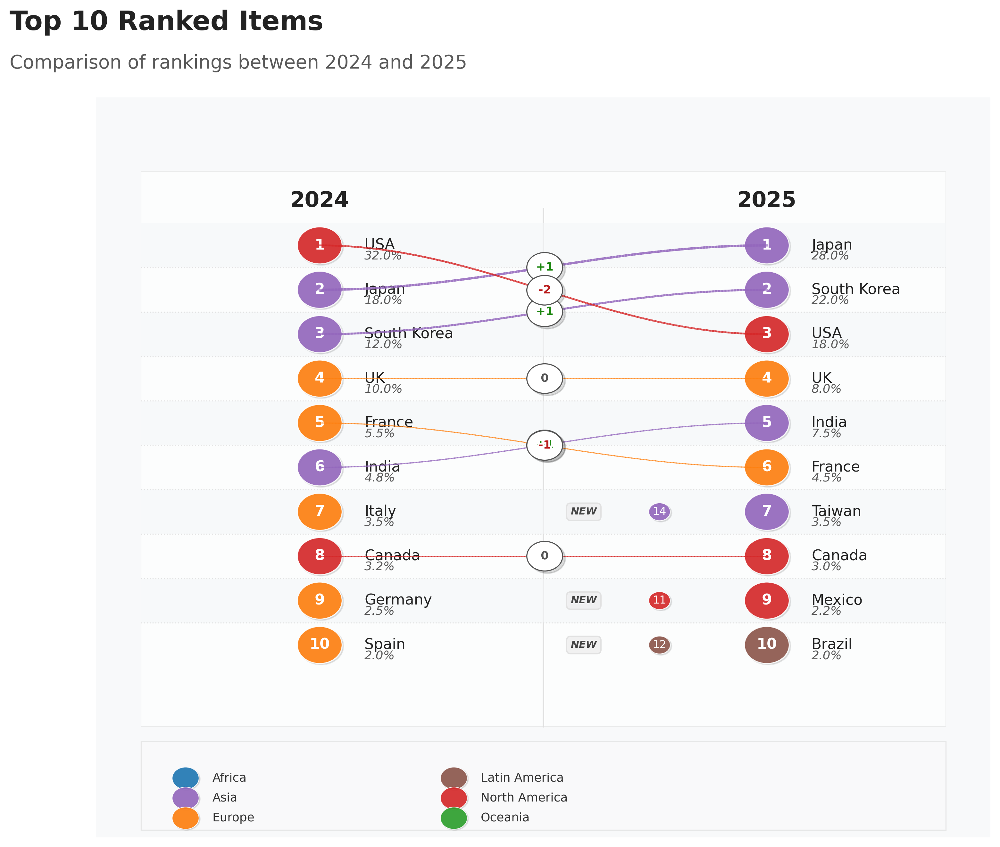

# Pretty Year-Over-Year Ranking

A CLI tool to generate beautiful year-over-year ranking visualizations showing how rankings change between consecutive years.



## Features

- Beautiful year-over-year ranking visualizations
- Flow connections between rankings across years
- Previous year position indicators
- Custom data via JSON files
- Color-coding by categories
- Customizable titles and subtitles
- High-resolution output (300 DPI)
- Special indicators for items moving in/out of top rankings
- Dynamic data processing via custom Python code
- **Database view**: tabular display of all ranking data with filtering and sorting
- **Insights summary**: statistical analysis with year-over-year change detection
- **CSV export**: export filtered and sorted data to CSV for further analysis
- **Filtering**: filter by category, rank range, or percentage range
- **Sorting**: sort by rank, item name, category, or percentage

## Installation

```bash
pip install -r requirements.txt
```

## Usage

### Basic Usage

```bash
python generate_ranking.py
```

### Common Options

```bash
# Custom output file
python generate_ranking.py -o my_visualization.png

# Custom title and subtitle
python generate_ranking.py -t "My Custom Title" -s "My custom subtitle goes here"

# Using custom data
python generate_ranking.py -d sample_data.json

# Set maximum entries to display (default is 10)
python generate_ranking.py --max-entries 15
```

### Database View

Print all ranking data in a tabular database-style view:

```bash
# Show all data as a table
python generate_ranking.py --database

# Filter by one or more categories (case-insensitive, comma-separated)
python generate_ranking.py --database --filter-category Electronics,Software

# Filter by rank range
python generate_ranking.py --database --filter-rank-min 1 --filter-rank-max 5

# Filter by percentage range
python generate_ranking.py --database --filter-min-percentage 5.0

# Sort by a specific field
python generate_ranking.py --database --sort-by percentage --sort-order desc
```

### Insights Summary

Print statistical analysis and year-over-year change detection:

```bash
# Show insights for all data
python generate_ranking.py --insights

# Combine with filters
python generate_ranking.py --insights --filter-category Asia
```

### CSV Export

Export filtered and sorted data to a CSV file:

```bash
# Export all data
python generate_ranking.py --export-csv output.csv

# Export top-5 entries per year, sorted by percentage
python generate_ranking.py --export-csv top5.csv --filter-rank-max 5 --sort-by percentage --sort-order desc
```

You can combine `--database`, `--insights`, and `--export-csv` in one command:

```bash
python generate_ranking.py --database --insights --export-csv output.csv --filter-category Europe
```

## Data Format

The data should be provided in JSON format:

```json
{
  "2023": [
    {"rank": 1, "item": "Product A", "category": "Electronics", "percentage": 32.0},
    {"rank": 2, "item": "Product B", "category": "Software", "percentage": 18.0},
    {"rank": 3, "item": "Product C", "category": "Electronics", "percentage": 12.0},
    {"rank": 4, "item": "Product D", "category": "Services", "percentage": 10.0},
    {"rank": 5, "item": "Product E", "category": "Services", "percentage": 5.5},
    {"rank": 6, "item": "Product F", "category": "Software", "percentage": 4.8},
    {"rank": 20, "item": "Product T", "category": "Hardware", "percentage": 0.2}
  ],
  "2024": [
    {"rank": 1, "item": "Product B", "category": "Software", "percentage": 28.0},
    {"rank": 2, "item": "Product C", "category": "Electronics", "percentage": 22.0},
    {"rank": 3, "item": "Product A", "category": "Electronics", "percentage": 18.0},
    {"rank": 20, "item": "Product U", "category": "Services", "percentage": 0.4}
  ]
}
```

Each item requires these properties:
- `rank`: Position in the ranking
- `item`: Name of the item
- `category`: Category for color-coding
- `percentage`: Numeric value representing the item's share

> **Note**: Include data beyond the top 10 (up to rank 20 or more) to properly show items that moved in or out of the top rankings.

## License

This project is open-source. Feel free to use and modify as needed.
