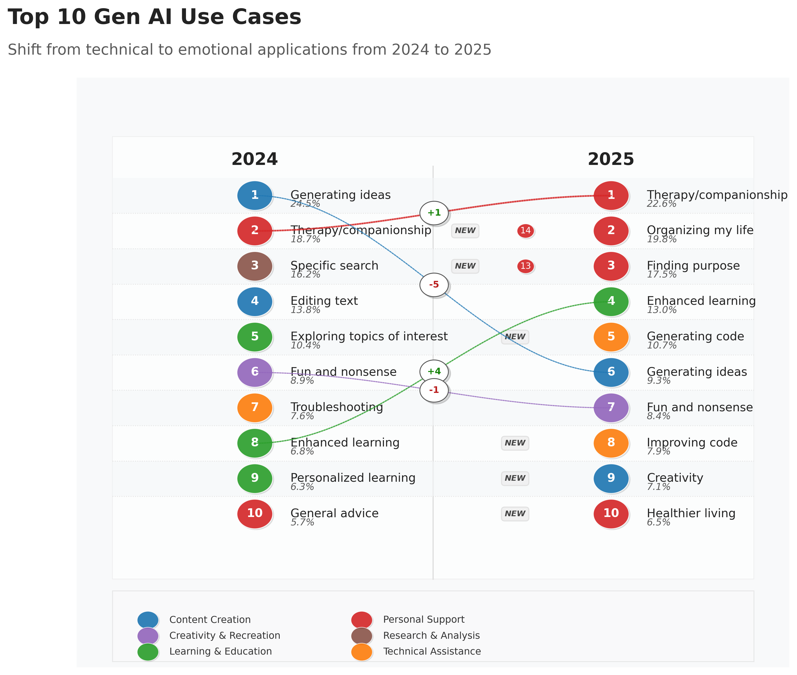

# Pretty Year-Over-Year Ranking

A CLI tool to generate beautiful year-over-year ranking visualizations showing how rankings change between consecutive years.



## Features

- Beautiful year-over-year ranking visualizations
- Flow connections between rankings across years
- Previous year position indicators
- Custom data via JSON files
- Color-coding by categories
- Customizable titles and subtitles
- High-resolution output (300 DPI)
- Special indicators for items moving in/out of top rankings
- Dynamic data processing via custom Python code

## Installation

```bash
pip install -r requirements.txt
```

## Usage

### Basic Usage

```bash
python generate_ranking.py
```

### Common Options

```bash
# Custom output file
python generate_ranking.py -o my_visualization.png

# Custom title and subtitle
python generate_ranking.py -t "My Custom Title" -s "My custom subtitle goes here"

# Using custom data
python generate_ranking.py -d sample_data.json

# Set maximum entries to display (default is 10)
python generate_ranking.py --max-entries 15
```

### Dynamic Code Processing

Transform your data before visualization:

```bash
# Sort items by percentage
python generate_ranking.py -d sample_data.json -c "data['2023'] = sorted(data['2023'], key=lambda x: x['percentage'], reverse=True)"

# Filter and transform data
python generate_ranking.py -d sample_data.json -c "data['2023'] = [x for x in data['2023'] if x['percentage'] > 1.0]" -c "for item in data['2024']: item['percentage'] *= 1.5"
```

## Data Format

The data should be provided in JSON format:

```json
{
  "2023": [
    {"rank": 1, "item": "Product A", "category": "Electronics", "percentage": 32.0},
    {"rank": 2, "item": "Product B", "category": "Software", "percentage": 18.0},
    {"rank": 3, "item": "Product C", "category": "Electronics", "percentage": 12.0},
    {"rank": 4, "item": "Product D", "category": "Services", "percentage": 10.0},
    {"rank": 5, "item": "Product E", "category": "Services", "percentage": 5.5},
    {"rank": 6, "item": "Product F", "category": "Software", "percentage": 4.8},
    {"rank": 20, "item": "Product T", "category": "Hardware", "percentage": 0.2}
  ],
  "2024": [
    {"rank": 1, "item": "Product B", "category": "Software", "percentage": 28.0},
    {"rank": 2, "item": "Product C", "category": "Electronics", "percentage": 22.0},
    {"rank": 3, "item": "Product A", "category": "Electronics", "percentage": 18.0},
    {"rank": 20, "item": "Product U", "category": "Services", "percentage": 0.4}
  ]
}
```

Each item requires these properties:
- `rank`: Position in the ranking
- `item`: Name of the item
- `category`: Category for color-coding
- `percentage`: Numeric value representing the item's share

> **Note**: Include data beyond the top 10 (up to rank 20 or more) to properly show items that moved in or out of the top rankings.

## Customization

The visualization supports various customization options:
- Colors for different categories
- Line thickness based on percentage values
- Custom titles and subtitles
- Output file format and resolution

## License

This project is open-source. Feel free to use and modify as needed.
